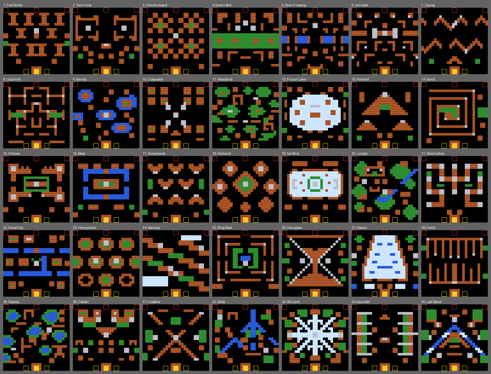

# TANK CITY — เกมรถถังสไตล์ Battle City สำหรับ Roblox

เกมยิงรถถังมุมมองจากด้านบน ทำตามกติกาของ Battle City (NES, 1985) เกือบทั้งหมด
ด่านทั้ง 35 ด่านออกแบบใหม่ในสไตล์เดียวกัน (ไม่ได้ลอกแผนที่ของ Namco)



## ติดตั้งใน Roblox Studio (ทำครั้งเดียว)

1. เปิด Roblox Studio → **New** → **Baseplate**
   (ถ้าใช้ไฟล์เดิมที่เคยลองแมพไว้ ให้ **ลบ** Script `BattleCityMap` และ LocalScript `BattleCityCamera` อันเก่าทิ้งก่อน)
2. ลบ `SpawnLocation` ใน Workspace ทิ้ง (เกมนี้ไม่ใช้ตัวละคร)
3. ใน **ServerScriptService** สร้าง 3 อย่าง แล้ววางโค้ดจากไฟล์ที่ชื่อตรงกัน
   (คลิกขวา → Insert Object → เลือกชนิด → เปลี่ยนชื่อให้ตรงทุกตัวอักษร)

   | ชนิด | ชื่อ | โค้ดจากไฟล์ |
   |---|---|---|
   | **ModuleScript** | `BattleCityCore` | `BattleCityCore.lua` |
   | **ModuleScript** | `BattleCityStages` | `BattleCityStages.lua` |
   | **Script** | `BattleCityServer` | `BattleCityServer.lua` |

4. ใน **StarterPlayer → StarterPlayerScripts** สร้าง **LocalScript** ชื่อ `BattleCityClient`
   แล้ววางโค้ดจาก `BattleCityClient.lua`
5. กด **Play** ▶️ — จะขึ้นม่าน "STAGE 1" แล้วเริ่มเล่นได้เลย

ลองเล่น 2 คนใน Studio: แท็บ **Test** → **Clients and Servers** → เลือก **2 Players** → **Start**
(คนที่ 3 ขึ้นไปจะดูได้อย่างเดียว ตั้งจำนวนผู้เล่นสูงสุดได้ที่ Game Settings → Places/Players)

## การควบคุม

| | ขับ | ยิง |
|---|---|---|
| ⌨️ คีย์บอร์ด | W A S D หรือ ปุ่มลูกศร | Space / J / Z |
| 🎮 จอย | D-pad หรือ สติ๊กซ้าย | A / X / R2 |
| 📱 มือถือ | ปุ่มทิศทางซ้ายล่าง | ปุ่ม FIRE ขวาล่าง |

กดยิงค้างไว้ = ยิงรัว (ยิงได้ทีละ 1 นัด หรือ 2 นัดเมื่อมีดาว 2 ดวงขึ้นไป)

## กติกา (เหมือนต้นฉบับ)

- ปกป้อง **ฐานนกอินทรี** 🦅 ถ้าโดนยิงแตก = GAME OVER (กระสุนเราเองก็ทำแตกได้!)
- ศัตรูด่านละ **20 คัน** ทำลายหมดผ่านด่าน, ด้านขวาของจอบอกจำนวนที่ยังไม่ออกมา
- เริ่มด้วย 3 ชีวิต (`IP` บนจอ = ชีวิตสำรอง) ได้เพิ่ม 1 ชีวิตเมื่อถึง 20,000 คะแนน
- ศัตรู: ธรรมดา 100 · เร็ว 200 · กระสุนแรง 300 · เกราะหนา (ยิง 4 ที) 400 คะแนน
- คันที่ **4, 11, 18** กระพริบแดง ยิงโดนแล้วไอเท็มโผล่:

| ไอเท็ม | ผล |
|---|---|
| ⭐ ดาว | อัปเกรดปืน: กระสุนเร็ว → ยิงได้ 2 นัด → ยิงเหล็กพัง (ตายแล้วรีเซ็ต) |
| 💣 ระเบิด | ศัตรูบนจอระเบิดหมด |
| 🛡️ หมวก | เกราะกันกระสุน 10 วินาที |
| 🧱 พลั่ว | กำแพงรอบฐานเป็นเหล็ก 20 วินาที |
| ⏰ นาฬิกา | ศัตรูหยุดนิ่ง 10 วินาที |
| 1UP | ชีวิตเพิ่ม 1 |

- แมพ: อิฐยิงพังทีละแถบ · เหล็กพังเฉพาะดาว 3 ดวง · น้ำข้ามไม่ได้แต่กระสุนบินผ่าน · ป่าซ่อนตัว · น้ำแข็งลื่น
- เล่น 2 คน: ยิงโดนเพื่อน = เพื่อนขยับไม่ได้ 3 วินาที, จบด่านคนที่ฆ่าได้มากกว่าได้โบนัส 1000

## ปรับแต่ง

- **ความยาก / ความเร็ว / เวลาไอเท็ม**: ตาราง `DEFAULT_CONFIG` ด้านบนของ `BattleCityCore`
  เช่น `PLAYER_SPEED`, `START_LIVES`, `AI_FIRE_RATE` (ศัตรูยิงถี่แค่ไหน), `SHOVEL_TIME`
- **ด่าน**: แก้ใน `BattleCityStages` — ตัวอักษร 1 ตัว = 1 ช่อง (`.` ว่าง `B` อิฐ `S` เหล็ก `W` น้ำ `T` ป่า `I` น้ำแข็ง)
  รายละเอียดอยู่ในคอมเมนต์ด้านบนไฟล์
- **เสียง**: ใส่ id เสียงจาก Creator Store ในตาราง `SOUNDS` ด้านบนของ `BattleCityServer` (ว่างไว้ = เงียบ)
- **ไอคอนบนพื้นกลับหัว?** เปลี่ยน `TOP_ICON_ROTATION` ใน `BattleCityServer` เป็น `180`

## ถ้าจะเผยแพร่บน Roblox

"Battle City" เป็นชื่อ/เครื่องหมายการค้าของ Bandai Namco — ในเกมจึงใช้ชื่อ **TANK CITY**
ตั้งชื่อเกมเป็นชื่ออื่นของตัวเองจะปลอดภัยกว่า

## สำหรับนักพัฒนา: ชุดทดสอบ

โค้ดทั้งหมดทดสอบได้นอก Roblox ด้วย Python (จำลอง Roblox API ใน `tests/roblox_stubs.lua`):

```
pip install lupa pytest
python -m pytest BattleCity/tests                       # ทดสอบทั้งหมด
python BattleCity/tests/test_stages.py                   # ตรวจด่านหลังแก้
```
