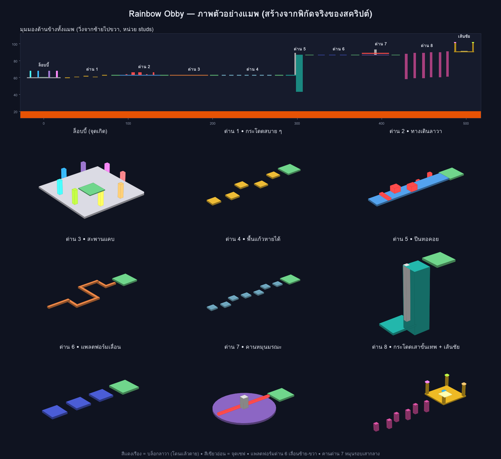

# 🌈 Rainbow Obby

แมพอ็อบบี้ (ปาร์คัวร์) 8 ด่าน ที่สร้างขึ้นเองด้วยสคริปต์ตัวเดียว พร้อมจุดเซฟ ลาวา แพลตฟอร์มเลื่อน คานหมุน และแท่นเส้นชัย

## วิธีใส่แมพลงเกม

1. เปิด **Roblox Studio** → **New** → **Baseplate**
2. หน้าต่าง **Explorer** → ชี้ที่ **ServerScriptService** → กดปุ่ม **+** → เลือก **Script**
3. ลบโค้ดเดิมใน Script ออก แล้วคัดลอกโค้ดทั้งหมดจาก [`RainbowObby.server.lua`](RainbowObby.server.lua) มาวาง
4. กด **Play** (F5) แมพจะถูกสร้างขึ้นตอนเริ่มเกม และผู้เล่นจะเกิดที่ล็อบบี้

## ด่านทั้งหมด

| ด่าน | ชื่อ | ต้องทำอะไร |
|---|---|---|
| 1 | กระโดดสบาย ๆ | กระโดดข้ามแท่นเล็กที่ค่อย ๆ สูงขึ้น |
| 2 | ทางเดินลาวา | กระโดดข้ามแถบลาวา และเดินอ้อมก้อนลาวา |
| 3 | สะพานแคบ | เดินบนคานแคบที่หักเลี้ยวซิกแซก |
| 4 | พื้นแก้วหายได้ | พื้นจะจางหายไปหลังเหยียบ 0.8 วินาที ต้องรีบวิ่งต่อ (พื้นจะกลับมาใน 2.5 วินาที) |
| 5 | ปีนหอคอย | ปีนบันไดโครงเหล็กขึ้นหอคอยสูง 24 studs |
| 6 | แพลตฟอร์มเลื่อน | จังหวะกระโดดขึ้นแพลตฟอร์มที่เลื่อนซ้าย-ขวา |
| 7 | คานหมุนมรณะ | กระโดดข้ามคานลาวาที่หมุนรอบเสากลาง |
| 8 | กระโดดเสาขั้นเทพ | กระโดดบนเสาเล็กระยะไกลไปถึงเส้นชัย |

## ระบบในเกม

- **จุดเซฟ** (แท่นสีเขียวอ่อนมีตัวเลข) ระหว่างทุกด่าน: ตายแล้วจะเกิดใหม่ที่จุดเซฟล่าสุด และต้องผ่านจุดเซฟตามลำดับ ข้ามด่านไม่ได้
- **สีแดงเรือง = ลาวา** โดนแล้วตายทันที ด้านล่างทั้งแมพก็เป็นทะเลลาวา ตกลงไปก็ตายเหมือนกัน
- **กระดานคะแนน** มุมขวาบนแสดง `Stage` (จุดเซฟล่าสุด) และ `Wins` (จำนวนครั้งที่ชนะ)
- **เส้นชัย**: เหยียบแท่นทองตรงกลางจะได้ +1 Win มีพลุสายรุ้ง แล้วถูกส่งกลับล็อบบี้เพื่อเล่นอีกรอบ
- จุดเกิดเดิมของเทมเพลต Baseplate จะถูกปิดอัตโนมัติ ทุกคนจึงเกิดที่ล็อบบี้

> คะแนน `Stage` และ `Wins` ยังไม่ถูกบันทึกเมื่อออกจากเกม (ถ้าต้องการต้องเพิ่มระบบ DataStore)

## อยากแต่งแมพเองใน Studio

ปกติแมพจะถูกสร้างตอนกด Play เท่านั้น ถ้าอยากเห็นและแก้ในหน้าแก้ไข ให้ทำแบบนี้:

1. กด **Play** ให้แมพถูกสร้างก่อน
2. ใน Explorer คลิก **Workspace → RainbowObby** แล้วกด **Ctrl+C**
3. กด **Stop**
4. คลิก **Workspace** แล้วกด **Ctrl+V** แมพจะอยู่ในหน้าแก้ไขถาวร

จากนั้นย้าย เปลี่ยนสี หรือเพิ่มชิ้นส่วนได้ตามใจ สคริปต์จะเห็นโฟลเดอร์ `RainbowObby` ที่มีอยู่แล้วและใช้แมพนั้นแทนการสร้างใหม่

หน้าที่ของแต่ละชิ้นกำหนดด้วย **Attributes** (ดูได้ในหน้าต่าง Properties ด้านล่างสุด) เพิ่มให้ Part ของตัวเองได้เลย:

| Attribute | ชนิด | ผล |
|---|---|---|
| `Kill` | boolean = true | โดนแล้วตาย |
| `Checkpoint` | number | เป็นจุดเซฟลำดับตามตัวเลขนั้น (ต้องเรียง 1, 2, 3, … ไม่ข้ามเลข) |
| `Fade` | boolean = true | พื้นจางหายหลังเหยียบ |
| `Finish` | boolean = true | แท่นชนะ (ต้องผ่านจุดเซฟเลขสูงสุดก่อน) |

## ปรับค่าในโค้ด

ค่าที่แก้ง่ายอยู่ด้านบนของสคริปต์และในตาราง `STAGES`:

- `BASE_Y`: ความสูงของล็อบบี้ (ทะเลลาวาจะอยู่ต่ำลงไป 40 studs)
- `STAGES`: ชื่อด่านและสีพื้นของแต่ละด่าน สลับลำดับด่านได้
- `AngularVelocity` ใน `buildSpinner`: ความเร็วคานหมุน (ยิ่งมากยิ่งยาก)
- `Speed` ใน `buildMovingPlatforms`: ความเร็วแพลตฟอร์มเลื่อน
